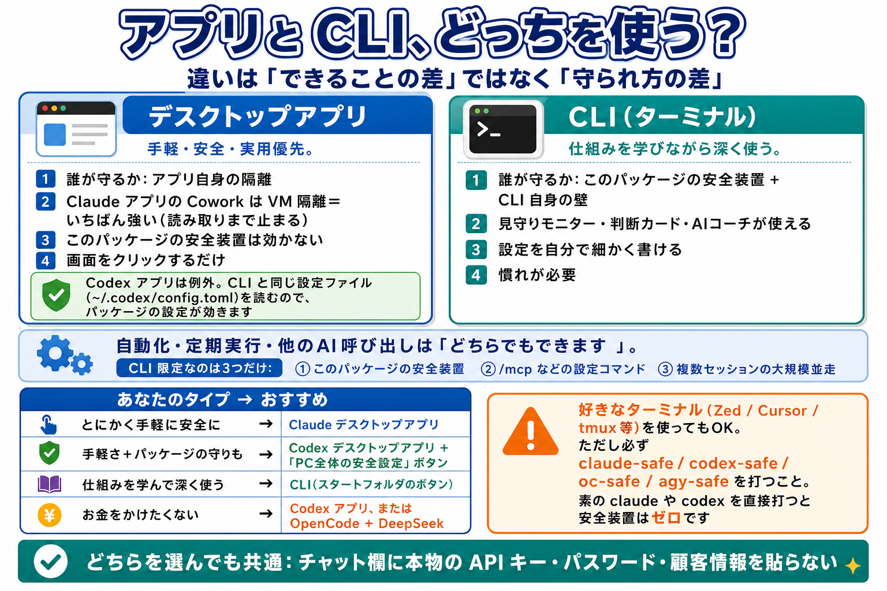

# 卒業後ガイド — ひとりで使い続けるために

講座が終わったあとも、この安全パッケージは**そのまま使い続けられます**。
このページは「卒業したら何が変わるのか」「アプリと CLI のどちらを使えばいいのか」「お金はいくらかかるのか」「困ったらどうするのか」を 1 枚にまとめた、卒業生のための正本です。上から順に読めば全部わかります。

---

## 1. 卒業で変わること・変わらないこと

### 1-1. 変わらないこと

- **安全装置はそのまま動きます**。危険なコマンドを実行前に止める仕組み（hook＝実行前チェック）、秘密ファイルの保護、見守りモニターは、卒業後も何も設定し直さずに使えます
- **スタートフォルダのボタンもそのまま**です。いつもどおりダブルクリックすれば動きます
- **作業フォルダ（`my-ai-workspace`）と、その中のあなたのファイルもそのまま**です

> **ボタンの番号が新しくなりました**（卒業版で整理しました）。講座中に覚えた番号と違う場合は、この対応表を見てください。
>
> | 講座中の名前 | いまの名前 |
> |---|---|
> | 0_Bouncer統合版を起動 | **1_AIをまとめて起動** |
> | 6_最新版に更新 | **8_安全パッケージを最新版に更新** |
> | （新設） | **9_AIツールを最新版に更新** |
> | 7_困ったとき診断 | **10_困ったとき診断**（Mac 版も新設） |
> | 7_野良d-claudeを退治 | **11_野良d-claudeを退治** |
> | 8_PowerShellを開く | **12_PowerShellを開く**（Windows のみ） |
> | 9_作業ウィンドウを開く | **13_作業フォルダを開く**（Windows のみ） |
> | （上級）5_モニターをコンソールで見る | **（上級）3_モニターをコンソールで見る** |
> | （上級）6_ステータスラインを入れる | **（上級）4_ステータスラインを入れる** |
> | （上級）7_危険コマンドをClaude全体で禁止 | **（上級）5_このPC全体に最低限の安全設定を入れる**（Claude / Codex / agy / OpenCode の 4 つに拡大） |
> | （上級）8_グローバル禁止を解除 | **（上級）6_PC全体の安全設定を解除** |
> | （上級）9_DeepSeekキーを削除 | **（上級）7_DeepSeekキーを削除** |
> | （上級）11_Bufferのキーを登録 | **（上級）8_Bufferのキーを登録** |
> | （上級）12_プラグインの置き場を開く | **（上級）9_プラグインの置き場を開く** |
> | （新設） | **（上級）10_コピーした文章から秘密を伏せる** |
> | （新設） | **（上級）11_伏せた文章を元に戻す** |
> | （新設） | **（上級）12_AIコーチのキーを削除** |
> | （新設） | **（上級）13_Bufferのキーを削除** |
> | （新設） | **（上級）14_新しい作業フォルダを安全にする** |
> | （新設） | **（上級）15_長時間おまかせモードで起動**（Claude / Codex / OpenCode / AntiGravity。Mac・Windows 両方。→ [4-8](#4-8-長時間おまかせモード目を離して任せる)） |
>
> 「2_セーフCodexを起動」「3_セーフClaudeを起動」「4_セーフAntiGravityを起動」「（上級）1_DeepSeekキーを登録」「（上級）2_DeepSeek-Claudeを起動」は変わっていません。「（上級）10_ccmuxを入れる」は廃止しました（ドキュメントの無いボタンだったためです）。
>
> **そのあと、番号がもう 1 つずつ繰り下がりました**（OpenCode の単独ボタンを基本枠に入れたためです）。上の表と合わせて、この表も見てください。
>
> | 前のバージョンの名前 | いまの名前 |
> |---|---|
> | （新設） | **5_セーフOpenCodeを起動** ← ここが増えました |
> | 5_見守りモニターを起動 | **6_見守りモニターを起動** |
> | 6_AIコーチのキーを登録 | **7_AIコーチのキーを登録** |
> | 7_安全パッケージを最新版に更新 | **8_安全パッケージを最新版に更新** |
> | 8_AIツールを最新版に更新 | **9_AIツールを最新版に更新** |
> | 9_困ったとき診断 | **10_困ったとき診断** |
> | 10_野良d-claudeを退治 | **11_野良d-claudeを退治** |
> | 11_PowerShellを開く | **12_PowerShellを開く**（Windows のみ） |
> | 12_作業フォルダを開く | **13_作業フォルダを開く**（Windows のみ） |
>
> これで **AI 4 種が 2〜5 に並びます**（2_Codex / 3_Claude / 4_AntiGravity / 5_OpenCode）。
> 上級（（上級）1〜15）の番号は変わっていません。

### 1-2. 変わること

1. **講師（山口さん）配布の API キーが終了します**。講座中に d-claude（DeepSeek 版 Claude Code）を「キー登録なし」で使えていたのは、山口さんのキーで動いていたからです。卒業後は使えなくなります → 対処は「[6. 山口さんのキーが使えなくなったら](#6-山口さんのキーが使えなくなったらd-claude-を使っていた人へ)」
2. **「困ったら講師へ」がなくなります**。かわりに、自分で解決できる道具（10_困ったとき診断・AI コーチ・このドキュメント群）を使います → 「[8. 困ったときの調べ方](#8-困ったときの調べ方サポート導線)」
3. **使う PC が、教室の PC から自分の PC に変わります**。自分の PC には本物の仕事のファイルや個人情報が入っています。**教室では「守るものが何も無い PC」でしたが、これからは違います。** このページの [4 章](#4-アプリと-cli-どっちを使えばいいのか) と [9 章](#9-守れない経路ここだけは自分で気をつける) を、必ず一度読んでください

---

## 2. まず結論 — 卒業後の選び方

迷ったら、この 3 行だけ覚えてください。

> ### 🖥️ 手軽に・安全に・実用優先 → **デスクトップアプリ**
> ### ⌨️ 仕組みを学びながら深く使えるようになりたい → **CLI**
> ### 💰 無料で使いたい → **Codex アプリ**、または **OpenCode + DeepSeek**

「アプリは初心者向けで、CLI は上級者向け」ではありません。**プロの現場でもアプリだけで完結している人はたくさんいます。** 選ぶ基準は「どちらが偉いか」ではなく、**あなたが何を優先したいか**です。

詳しくは次の 4 章で説明します。

---

## 3. 費用の一覧（これだけ見れば全部わかる）

料金は変わることがあるため、このページには**固定の金額を書きません**。必ず公式ページで最新の料金を確認してください。

| 使うもの | 費用 | 確認先（公式） |
|---|---|---|
| AntiGravity（agy） | **無料** | https://antigravity.google |
| AI コーチ用の Google AI Studio キー | **無料**（無料枠の範囲） | https://aistudio.google.com/apikey |
| Codex デスクトップアプリ | **無料プランでも使えます**（実機で確認） | https://openai.com/chatgpt/pricing/ |
| Codex CLI / ChatGPT の上位プラン | プランによる（**必ず公式で確認**） | https://openai.com/chatgpt/pricing/ |
| Claude（アプリ・CLI とも） | 有料プラン（**無料プラン不可**） | https://claude.com/pricing |
| DeepSeek（OpenCode から使う場合） | **従量チャージ**（使ったぶんだけ。少額から） | https://platform.deepseek.com |
| OpenCode Go（契約プラン） | 有料契約 | https://opencode.ai |

### 3-1. DeepSeek のチャージのやり方

1. ブラウザで **DeepSeek Platform**（https://platform.deepseek.com）を開き、アカウントを作ってログインします
2. 画面のメニューから **残高・支払い（Billing / Top up）** のページを開きます
3. **チャージ（Top up）** を選び、金額を入れて支払います。金額は「まず少額」で大丈夫です（使い切ったら足せます）
4. **API keys** のページで **新しいキーを作成**し、表示された文字列をコピーします（この画面を閉じると二度と表示されません）
5. スタートフォルダの **「（上級）1_DeepSeekキーを登録」** をダブルクリックして、コピーしたキーを貼り付けます
6. あとは **「1_AIをまとめて起動」→ OpenCode + DeepSeek** を選ぶだけです

> 画面の名前やメニューの位置は変わることがあります。迷ったら「残高（Balance）」「チャージ（Top up）」「API keys」という言葉を探してください。

---

## 4. アプリと CLI、どっちを使えばいいのか



> 図の右下の注意書き（「素の claude や codex を直接打つと安全装置はゼロです」）は、**「（上級）5_このPC全体に最低限の安全設定を入れる」を押していない場合**の話です。押してあれば見張りと記録は効きます。正確な内訳は [9-3](#9-3-素の-codex--claude--opencode-を直接起動した場合) を見てください。

ここが卒業後にいちばん迷うところなので、**正直に、詳しく書きます。**

### 4-1. 違いは「できることの差」ではなく「守られ方の差」です

まず、いちばん大きな誤解をほどきます。

> **アプリでできないことは、ほとんどありません。**

「自動化」「定期実行」「他の AI を呼び出す」「複数のファイルをまとめて直す」— こういった作業は、**アプリでもできます**。「CLI じゃないとできない」と説明されることがありますが、それは正確ではありません。

では何が違うのか。**守られ方が違います。**

| | デスクトップアプリ | CLI |
|---|---|---|
| **誰が守るか** | **アプリ自身**が持っている隔離の仕組み | **このパッケージ**が付けた安全装置＋CLI 自身の壁 |
| **このパッケージの安全装置** | **効きません**（Claude の場合。Codex は例外 → 4-4） | **効きます** |
| **強さ** | Claude デスクトップアプリは **VM（仮想マシン）隔離**。読み取りまで止まる、いちばん強い方式 | 壁（OS が止める）＋見張り（リスト照合）。**読み取りは壁では止まらない**ので、見張りが担当 |
| **設定の自由度** | アプリの画面でできる範囲 | 設定ファイルを直接書ける |
| **何が起きたかの記録** | アプリの画面で見る | **見守りモニター**で日本語の判断カードつきで見られる |

### 4-2. CLI にしかできないこと — 実は 3 つだけです

正直に数えると、実質的な差は**この 3 つだけ**です。

#### ① このパッケージの安全装置は、CLI にしか効きません

このパッケージの安全装置（実行前チェック・見守りモニター・日本語の判断カード・秘密を伏せる機能・AI コーチ）は、**hook（フック）という仕組み**で動いています。hook は「AI が『これからコマンドを実行します』と申告する通り道」に割り込む機能で、**これは CLI の機能です。**

実際、Claude Code の設定ファイル `~/.claude/settings.json` には `hooks` / `permissions` / `sandbox` という項目がありますが、**Claude デスクトップアプリの設定ファイルには、それに相当する項目がありません**（あるのは作業フォルダの指定と表示の好みだけです）。**設定でどうにかなる話ではなく、構造の違いです。**

**ただし「アプリは危ない」という意味ではありません。** アプリはアプリ自身の隔離で守っています。Claude デスクトップアプリの Cowork は **VM（仮想マシン）隔離** — PC の中にもう 1 台の仮想的なコンピュータを作り、その中だけで作業させる方式です。**これは読み取りまで止まる、いちばん強い隔離**です。守り方の系統が違うだけです。

#### ② 設定を変えるスラッシュコマンドは CLI だけです

`/mcp`（外部ツールの接続）、`/sandbox`（隔離の設定）、`/permissions`（許可・拒否の設定）のような**設定系のスラッシュコマンド**は、CLI だけのものです。細かく調整したいときは CLI が必要になります。

#### ③ たくさんのセッションを同時に走らせる大規模な並走作業

「10 個の作業を別々の AI に同時にやらせて、あとで結果を突き合わせる」のような、**複数の常駐セッションにまたがる大規模な並走**は、CLI の土俵です。ターミナルの窓をいくつも開いて管理する形になるので、アプリよりも CLI のほうが素直にできます。

### 4-3. 逆に、アプリのほうが優れていること

- **手軽です。** インストールしてログインすれば使えます。ターミナルの使い方を覚える必要がありません
- **Claude デスクトップアプリは隔離が強いです。** VM 隔離は、このパッケージが CLI に付けている壁よりも強い方式です（**読み取りまで止まる唯一の方式**）
- **画面が分かりやすい。** ファイルの差分や進捗が視覚的に確認できます

### 4-4. 【重要】Codex のデスクトップアプリには、このパッケージの設定が効きます

**これは、これまでの説明の訂正です。**

Codex のデスクトップアプリは、**CLI とまったく同じ設定ファイル（`~/.codex/config.toml`）を読んでいます**。アプリの設定画面に「config.toml を開く」という項目があり、アプリ側の「サンドボックス設定＝ワークスペース内での書き込み」という表示が、設定ファイルの `sandbox_mode = "workspace-write"` と一致することを確認しました。

つまり —

> **スタートフォルダの「（上級）5_このPC全体に最低限の安全設定を入れる」で PC 全体の安全設定を入れておけば、Codex のデスクトップアプリにもそれが効きます。**

「デスクトップアプリにはこのパッケージが介入できない」という従来の説明は、**Codex については誤り**でした。訂正します。

### 4-5. じゃあ結局どうすればいいのか

| あなたのタイプ | おすすめ | 理由 |
|---|---|---|
| **とにかく安全に、手軽に使いたい** | **Claude デスクトップアプリ** | VM 隔離がいちばん強い。設定を覚えなくていい |
| **手軽に使いたいが、このパッケージの守りも欲しい** | **Codex デスクトップアプリ** ＋「（上級）5_このPC全体に最低限の安全設定を入れる」 | アプリなのにパッケージの設定が効く（4-4） |
| **仕組みを学んで、深く使えるようになりたい** | **CLI**（スタートのボタンから起動） | 見守りモニター・判断カード・AI コーチがフルで働く。**何が起きているかが全部見える**ので、いちばん勉強になる |
| **お金をかけたくない** | **Codex デスクトップアプリ**（無料プランでも使えます）、または **OpenCode + DeepSeek**（少額チャージ） | ※ 使える範囲や条件は変わります。金額はここには書きません。必ず公式の料金ページで確認してください |

**両方使ってもかまいません。** 実際、多くの人がそうしています。「調べもの・下書きはアプリ、コードをがっつり触るときは CLI」といった使い分けが自然です。

### 4-6. どちらを選んでも、これだけは同じです

**チャット欄に本物の API キー・パスワード・顧客情報を貼らない。** これは、どんな道具でも防げません。**あなたにしか守れない部分です。**

### 4-7. ターミナルは好きなものを使ってかまいません

好きなターミナルを使ってかまいません。導入すると `~/.ai-safety/bin/` に **`claude-safe` / `codex-safe` / `oc-safe` / `agy-safe`** の 4 つが置かれ、PATH にも通ります。**Zed / Cursor / tmux / Orca / Windows Terminal など、どのターミナルからでも、この名前で打てばボタンと同じ安全な起動になります。**

ただし必ず `claude-safe` / `codex-safe` / `oc-safe` / `agy-safe` を使ってください（素で打ったときの違いは上の表のとおりです）。

> **Windows Terminal について（必須ではありません）**
> Microsoft 純正のターミナルアプリです。Windows 11 には最初から入っていて、Windows 10 は Microsoft Store から無料で入れられます。タブが使えるほか、**日本語や絵文字が正しく表示される**のが利点です。Windows 標準のコンソール（黒い画面）は日本語が化けやすいので、**表示が崩れて困ったときに試す**くらいの位置づけで大丈夫です。

---

## 4-8. 長時間おまかせモード（目を離して任せる）

**「（上級）15_長時間おまかせモードで起動」** は、**目を離して AI に長く作業させる**ためのモードです。確認ダイアログをほとんど出さずに進みます。

**Claude / Codex / OpenCode / AntiGravity のどれでも、Mac でも Windows でも使えます。** ボタンを押すとメニューが出るので、番号で AI を選んでください。

```
  どの AI におまかせしますか。番号を入れて Enter を押してください。

    1) Claude       （壁あり）
    2) Codex        （壁あり）
    3) OpenCode     （壁なし）
    4) AntiGravity  （壁なし）

    0) やめる
```

### 「壁」があるかどうかで扱いが変わります

**壁**とは、**OS が作業フォルダの外への書き込みを強制的に止める仕組み**（サンドボックス）のことです。AI がどんな手を使っても越えられません。

| | 壁 | 説明 |
|---|---|---|
| Mac の Claude | **あり** | Claude Code 純正サンドボックス（Seatbelt）。作業フォルダの外への書き込みと、許可外サイトへの通信を止めます |
| Mac の Codex | **あり** | Codex 純正サンドボックス（`--sandbox workspace-write`） |
| Windows の Codex | **あり** | Codex 純正サンドボックス（`windows.sandbox=unelevated`）。**書き込みは止まりますが、ネットの遮断は行いません** |
| Windows の Claude | なし | Claude Code の壁は公式に macOS / Linux / WSL2 のみ対応です（公式 https://code.claude.com/docs/en/sandboxing ） |
| OpenCode（Mac / Windows） | なし | OS の壁はありません |
| AntiGravity（Mac / Windows） | なし | `--sandbox` は付けていますが、独立した検証をしていないので「壁あり」とは数えていません |

- **壁がある場合** … 内容を表示して Enter を押すと起動します。さらに **「壁を立てられなかったら起動しない」設定**（Claude は `sandbox.failIfUnavailable`）をこのモード用の一時設定にだけ入れているので、**壁なしで走ることはありません**。
- **壁が無い場合** … 起動前に **一度だけ確認**が出ます。

> ```
>   ⚠ この環境には「壁」がありません。
>   壁（OS による書き込み制限）が使えないため、AI が作業フォルダの外の
>   ファイルを書き換えることを OS の力で止めることはできません。
>   止まるのは危険コマンドの禁止リストだけです。
>
>   目を離す前提で続けますか。
>
>   続けるなら「はい」と入力して Enter（やめるなら Enter だけ）:
> ```
>
> **「はい」と入力しないかぎり起動しません。** Enter だけを押せば、何も起きずに終わります。

> **以前のバージョン（v1.17.0）では、壁が無い環境ではこのボタンは起動を拒否していました。**
> 「壁が無いなら使わせない」という作りでしたが、**壁が無くても禁止リスト・見張り・記録は効きます**。
> 使えるものを使わせないのは過剰だったので、**確認を 1 回取ったうえで使える**ようにしました。

### それでも止まるもの（どの AI・どの OS でも外していません）

| 止まるもの | 例 |
|---|---|
| 再帰削除 | `rm -rf` |
| 秘密ファイルの読み取り | `.env` / SSH 鍵 / クラウドの資格情報 |
| ダウンロードしたものをそのまま実行 | `curl` の結果をそのままシェルに流す形 |
| 管理者権限 | `sudo` |
| 取り消しにくい公開・ローカルを壊す操作 | `git push` / `git reset` / `git checkout` / `git restore` / `git rebase` |
| **「全部素通しモード」への切り替えそのもの** | `disableBypassPermissionsMode: "disable"` を維持しています |

> **通常モードでは「確認します」になっている `sudo` や `git push` は、このモードでは「禁止」に変わります。** 目を離しているあいだに確認が出ても、答える人がいないからです。答えられないなら通すのではなく、**止める側に倒しました**。これらが必要になったら、いつものボタン（2〜5）で人が見ながらやってください。
>
> OpenCode の場合は、同じ理由で **インターネットのページ取得（webfetch）と Web 検索も「禁止」** になります。外へ出す操作は、無人では確認できないからです。

記録（見守りモニターと監査ログ）は、**どの AI・どの OS でも 1 つも外していません**。

### 止まらないもの（ここは自分で気をつける）

**作業フォルダの中のファイルの読み取り・書き換え・削除は止まりません。** 壁は「外」を守るもので、「中」は自由だからです。
**壁が無い環境では、作業フォルダの外への書き込みも OS では止められません**（禁止リストに載っている形だけが止まります）。

- **この作業フォルダに大事なファイルを置かないでください**（バックアップの取っていない原稿・顧客データなど）
- **終わったら記録を必ず確認してください**（「6_見守りモニターを起動」、または `~/.ai-safety/logs/`）

### AGI Cockpit の「フルアクセスモード」との違い

似ていますが、**根拠が違います**。

| | AGI Cockpit のフルアクセス | このパッケージの長時間おまかせモード |
|---|---|---|
| 何をしている | **人の承認を省く**（聞かずに実行する） | **その環境で使える最大限の守りを効かせたうえで**、確認だけを省く |
| 越えられない境界 | 特に無い | 壁がある環境では、作業フォルダの外・許可外の通信（カーネルが強制） |
| 危険コマンド | 設定次第 | **deny 床はそのまま**（再帰削除・秘密の読み取り・`sudo` 等は禁止） |
| 壁が無いとき | 何も言わない | **「壁がありません」と表示して、同意を取ってから進む** |

### 設定は汚れません

このモードは、**恒久的な設定ファイル（作業フォルダの `.claude/settings.json` や `~/.claude/settings.json`）を書き換えません**。起動のたびに一時フォルダへこのモード用の設定を書き出して渡し、終了時に消します。ですので**このモードを使ったあとも、通常の起動は今までどおり**です。

---

## 5. 課金状況別・あなたの使い方

この表は [00_はじめに.md](00_はじめに.md) と同じ「正本」です。自分の行だけ読めば OK です。
「守られ方」の欄の**壁・見張り・記録係**という言葉の意味は、[91_やさしい仕組み解説.md](91_やさしい仕組み解説.md) の 3 章にあります。

| あなたの課金状況 | 使う AI | どこから起動するか | 守られ方 |
|---|---|---|---|
| 無課金 | AntiGravity（agy・無料） | スタート「4_セーフAntiGravityを起動」 | 見張り＋記録係 |
| 無課金（Claude 相当が欲しい） | OpenCode + DeepSeek（少額チャージ） | スタート「1_AIをまとめて起動」→ OpenCode を選ぶ | 見張り＋記録係（**壁は無い**。用途を DeepSeek に絞ってください） |
| 無課金（Codex を使いたい） | **Codex デスクトップアプリ**（無料プランでも使えます） | アプリを起動 ＋「（上級）5_このPC全体に最低限の安全設定を入れる」を 1 度押しておく | 壁（アプリ自身）＋見張り＋記録係（4-4 参照） |
| ChatGPT 課金 | Codex CLI | スタート「1_AIをまとめて起動」→ Codex、または「2_セーフCodexを起動」 | **壁**＋見張り＋記録係（Mac / Windows とも） |
| Claude 課金 | Claude Code | スタート「3_セーフClaudeを起動」、または AGI Cockpit（作業フォルダ = my-ai-workspace） | Mac は**壁**＋見張り＋記録係 / **Windows は見張り＋記録係**（Claude Code がネイティブ Windows のサンドボックスに未対応のため） |
| 複数課金 | 複数エージェント | AGI Cockpit を司令塔に Claude を使い、Codex はスタート「2_」ボタンから | [11_AGI-Cockpitで使う.md](11_AGI-Cockpitで使う.md) 参照 |

補足:

- **ブラウザの ChatGPT / Claude.ai** はそのまま使えますが、このパッケージの守備範囲外です
- **Claude Code / Claude デスクトップアプリは無料プランでは使えません**。無課金で Claude 相当が欲しい場合は OpenCode + DeepSeek 経路へ
- **どの AI でも「壁」は読み取りを止めません。** 秘密のファイルを守っているのは「見張り」のほうです。だから `.ai-safety` フォルダを消さないでください

---

## 6. 山口さんのキーが使えなくなったら（d-claude を使っていた人へ）

講座中の **d-claude（DeepSeek 版 Claude Code）** は、講師（山口さん）が配布した API キーで動いていました。**卒業後はこのキー配布が終了するため、d-claude はそのままでは使えなくなります。**

### 6-1. 何が起きるか（エラーの見え方）

- d-claude を起動すると、応答が返らなくなる、または「認証エラー」「401 / Unauthorized（許可されていません）」「Insufficient Balance（残高不足）」のようなエラーが出ます
- ある日突然そうなったら、故障ではなく**キーの失効**です。あわてなくて大丈夫です

### 6-2. 移行先（2 つのどちらか）

1. **OpenCode + 自分の DeepSeek キー（おすすめ・少額チャージ）**
   - 「[3-1. DeepSeek のチャージのやり方](#3-1-deepseek-のチャージのやり方)」の手順で自分のキーを作って登録すれば、**同じ「1_AIをまとめて起動」から OpenCode + DeepSeek** が使えます
   - 自分のキーを登録すれば、d-claude も引き続き同じメニューから使えます
2. **OpenCode Go（有料契約）へ移行**
   - キー管理をしたくない人向けの契約プランです。内容と料金は公式サイト（https://opencode.ai）で確認してください

### 6-3. 片付け

過去に d-claude の設定が PC のあちこちに残っていると、素の（保護なしの）d-claude が起動してしまうことがあります。スタートフォルダの **「11_野良d-claudeを退治」** をダブルクリックすると、正規の場所以外に残った d-claude を掃除できます。

---

## 7. 更新はこれからも受け取れます

卒業後も、パッケージの更新は**ボタンを押すだけ**で受け取れます。覚えることは 1 つだけです：

> **「7 → 8」の順に押す。** これが卒業後の更新手順のすべてです。

### 7-1. 「8_安全パッケージを最新版に更新」（パッケージ本体）

安全装置・ボタン・ドキュメントなど、**このパッケージ自体**を最新版にします。配布元から取得して、改ざんされていないかの照合（SHA-256 ハッシュ照合）をしてから入れ替えます。

### 7-2. 「9_AIツールを最新版に更新」（AI 本体）

Codex CLI / Claude Code / OpenCode という **AI ツール本体**を最新版に更新します。

- 入っていないツールは自動でスキップします（勝手に新しいツールを入れたりはしません）
- agy は公式の自動更新に任せるため、このボタンの対象外です（[09_各AIのインストール.md](09_各AIのインストール.md) 参照）

### 7-3. 更新が来なくなったときの見分け方

- 「7」を押しても何ヶ月も「更新はありません」のままなら、配布が止まっている可能性があります
- その場合でも**いま入っている安全装置はそのまま動き続けます**。使うのをやめる必要はありません
- ただし、AI ツール側の大きな仕様変更で hook が動かなくなったときは、[99_known_issues.md](99_known_issues.md) の「CLI メジャーアップデート後に hook が動かない」を見てください

### 7-4. 卒業後は「自分の道具」を増やして育てられます

安全パッケージは、**あなたが自分でスキルやコマンドを増やすための置き場を開けてあります**。だから AI に対して、

> 「このスキルをグローバルに入れておいて」

と**そのまま頼めます**。断られません。書ける場所は `~/.claude/skills/` `~/.claude/commands/` `~/.codex/prompts/` `~/.codex/skills/` `~/.gemini/commands/` `~/.gemini/skills/` `~/.config/opencode/command/` `~/.config/opencode/skills/`（Windows も同じ並び）です。

一方で、**AI が自分を縛っている安全設定そのものを書き換えることはできません**。`~/.claude/settings.json` `~/.codex/config.toml` `~/.gemini/settings.json` `~/.config/opencode/opencode.json` と `~/.ai-safety/`・鍵の置き場は、卒業後も閉じたままです。これらを変えたいときは、**あなた自身が**エディタで開くか「（上級）5_このPC全体に最低限の安全設定を入れる」を押してください。

> **道具は増やせる。守りは外せない。** この線引きのままなら、環境をどれだけ育てても安全側は薄くなりません。
>
> どこが開いていてどこが閉じているかの全リスト → [12_設定ファイルの置き場マップ.md](12_設定ファイルの置き場マップ.md) の「3-3-2」

---

## 8. 困ったときの調べ方（サポート導線）

卒業後は「講師に聞く」のかわりに、**この順番**で自分で確かめます。ほとんどの問題はこの 3 段で解決します。

### 8-1. まず「10_困ったとき診断」

スタートフォルダの **「10_困ったとき診断」** をダブルクリック。安全装置が正しく動いているかを自動で検査し、結果を日本語で表示します。

### 8-2. 「99_既知の問題」を見る

[99_known_issues.md](99_known_issues.md) に、これまでに見つかった問題と直し方がまとまっています。エラーメッセージの言葉で探してみてください。

### 8-3. AI コーチ /「/なおして」に聞く

- 見守りモニターの **AI コーチ**（無料キー登録が必要。「7_AIコーチのキーを登録」）に、エラーや操作の意味を日本語で相談できます
- OpenCode を使っている人は、入力欄で **`/なおして`** と打ってエラーメッセージを貼ると、意味・原因・直し方を手順で出してくれます

### 8-4. それでも駄目なとき

このパッケージの卒業後サポートは、**上の道具で自分で解決する「自走型」**です。専用の質問窓口はありません。上の 3 段で解決しないときは、エラーメッセージをそのまま検索するか、各 AI ツールの公式ドキュメント・公式サポートを確認してください。

**エラーメッセージに出てくる英単語を、そのまま検索してください。** [92_AIの仕組みと隔離技術.md](92_AIの仕組みと隔離技術.md) で用語を覚えてもらっているのは、このためです。

---

## 9. 守れない経路（ここだけは自分で気をつける）

安全パッケージは万能ではありません。**次の 4 つは保護の外**です。くわしい理屈は [91_やさしい仕組み解説.md](91_やさしい仕組み解説.md) と [90_守れる-守れない.md](90_守れる-守れない.md) にあります。

### 9-1. 「壁」は読み取りを止めません

Codex や Claude Code の壁（OS のサンドボックス）が止めるのは、**作業フォルダの外への書き込み**と**通信**だけです。**読み取りは止まりません。** `~/.ssh/` やホームフォルダのメモは、壁が有効でも読めます。

これを止めているのは、このパッケージの**見張り（`.ai-safety` フォルダ）**です。**消さないでください。**

### 9-2. チャット欄への手動ペースト

あなた自身が本物の API キー・パスワード・顧客情報を AI のチャット欄に貼れば、その瞬間に外部へ送信されます。**これはどんな道具でも防げません。貼らない習慣だけが防御です**

外部の AI（DeepSeek など）に長い文章を渡すときは、スタートフォルダの **「（上級）10_コピーした文章から秘密を伏せる」** を使ってください。詳しくは [13_秘密の入れ物-APIキーの安全な持ち方.md](13_秘密の入れ物-APIキーの安全な持ち方.md)。

### 9-3. 素の codex / claude / opencode を直接起動した場合

**素の `claude` や `codex` を直接打つのは、おすすめしません。** ただし「一切効かない」かどうかは、**スタートフォルダの「（上級）5_このPC全体に最低限の安全設定を入れる」を押してあるかどうか**で変わります。

| | 上級 5 を**押していない** | 上級 5 を**押してある** |
|---|---|---|
| **見張り**（危険コマンドの禁止・秘密ファイルの保護） | **効きません** | **効きます**（Claude / Codex / OpenCode / agy の 4 つすべてに配線されます） |
| **記録係**（ログに残る） | **効きません** | **効きます**（ボタン起動と同じログに残ります） |
| **壁**（Codex） | **効きません** | **効きます**（`sandbox_mode = "workspace-write"`。Codex デスクトップアプリにも同時に効きます） |
| **壁**（Claude） | **効きません** | **効きません**（PC 全体の設定には壁を入れていません。Claude の壁は作業フォルダの中でだけ効きます） |
| CLAUDE.md・スキル・`.aiexclude`・日本語の説明書 | ありません | ありません（作業フォルダ固有のものなので） |

つまり **上級 5 を押していない状態で素起動すると、設定ゼロ＝全権限で、パソコン全体が作業対象**になります。押してあれば、見張りと記録は効きます。

**なので普段はボタン、または `claude-safe` / `codex-safe` / `oc-safe` / `agy-safe` を使ってください。上級 5 は「うっかり素で起動してしまったとき」の保険です。**

- 必ずスタートフォルダのボタンか、**`claude-safe` / `codex-safe` / `oc-safe` / `agy-safe`** という短い名前から起動してください（→ [4-7](#4-7-ターミナルは好きなものを使ってかまいません)）
- 保険として **「（上級）5_このPC全体に最低限の安全設定を入れる」** を 1 回押しておいてください
- `my-ai-workspace` 以外のフォルダで作業したくなったら、**「（上級）14_新しい作業フォルダを安全にする」** でそのフォルダを安全にしてから使ってください
- どこに何の設定ファイルがあるのかは [12_設定ファイルの置き場マップ.md](12_設定ファイルの置き場マップ.md) にまとめてあります
- また、AGI Cockpit から **Codex** を使う経路も保護が乗りません（Codex は「2_セーフCodexを起動」から。→ [11_AGI-Cockpitで使う.md](11_AGI-Cockpitで使う.md)）

### 9-4. ブラウザの AI・Claude デスクトップアプリ

ブラウザの ChatGPT / Claude.ai や、Claude デスクトップアプリ（Cowork）には、このパッケージの見張りが**構造的に入れません**（[4-2](#4-2-cli-にしかできないこと--実は-3-つだけです) 参照）。Claude デスクトップアプリには **VM 隔離**という別の、しかもより強い防御があります。

**Codex のデスクトップアプリは例外で、このパッケージの PC 全体設定が効きます**（[4-4](#4-4-重要codex-のデスクトップアプリにはこのパッケージの設定が効きます)）。

---

## 10. 卒業チェックリスト

最後に、一度だけ確認してください。

- [ ] スタートフォルダのボタンが動く（**「10_困ったとき診断」** を 1 回押した）
- [ ] **「（上級）5_このPC全体に最低限の安全設定を入れる」** を 1 回押した（素で起動したときの保険）
- [ ] 別のフォルダで作業するときは **「（上級）14_新しい作業フォルダを安全にする」** を使う、と覚えた
- [ ] 自分は**アプリ**を使うのか **CLI** を使うのか、決めた（[4 章](#4-アプリと-cli-どっちを使えばいいのか)）
- [ ] **API キーを金庫に入れた**（[13_秘密の入れ物-APIキーの安全な持ち方.md](13_秘密の入れ物-APIキーの安全な持ち方.md)）
- [ ] `.env` に本物のキーが平文で残っていないか確認した
- [ ] **「壁は読み取りを止めない」「だから `.ai-safety` を消さない」**を理解した
- [ ] チャット欄に本物の秘密を貼らない、と決めた

---

ここまで読めば、卒業後の準備は完了です。安全装置と一緒に、これからも安心して AI を使い倒してください。
