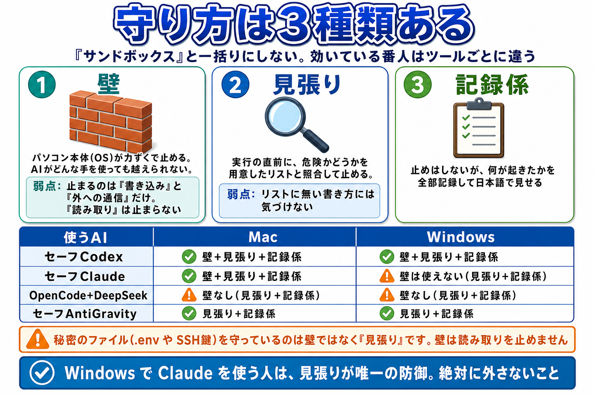

# やさしい仕組み解説 — 何を・どうやって・どこまで守るか

このページは、「この安全パッケージは何をしているのか」をやさしく説明する版です。
正確さ優先の正本は [90_守れる-守れない.md](90_守れる-守れない.md)、技術のくわしい話は [92_AIの仕組みと隔離技術.md](92_AIの仕組みと隔離技術.md) にあります。まずはこのページだけで大丈夫です。

> 専門用語はところどころ出てきますが、必ず説明を添えます。**用語を覚えてもらうこと自体が目的**です。卒業後に自分でエラーを調べるとき、言葉を知っているかどうかで大きく差がつきます。

---

## 1. この安全パッケージは「家の防犯」に似ています

AI エージェント（あなたのパソコンでファイルを読み書きしたり、コマンドを実行したりする AI）は、たとえるなら**家に上げたお手伝いさん**です。とても働き者ですが、ときどき勘違いをしますし、外から悪い指示（プロンプトインジェクション＝AI をだます書き込み）を吹き込まれることもあります。

だからこの家（あなたの PC）には防犯設備を付けました。

### この防犯設備ぜんぶの名前が「Bouncer（用心棒）」です

説明書や画面に出てくる **Bouncer（バウンサー／用心棒）** は、**このパッケージの安全装置ぜんぶをまとめた呼び名**です。特定のファイルや特定のプログラム 1 本を指す言葉ではありません。

中身は、役割で 3 人に分かれています。

| 役割 | 何をする人か | 実際にやっていること |
|---|---|---|
| **止める人** | 実行される**前**に、危ないものを止めます | 実行前チェック（hook）／ OpenCode のプラグイン／ 権限リスト |
| **見せる人** | 止めはしませんが、**何が起きたかを全部見せます** | 見守りモニター（判断カード・記録・AI コーチ） |
| **伏せる人** | 外へ出ていく文章から、**秘密を伏せます** | 送信検査とマスキング（`.env` の中身や API キーを伏せ字にする） |

このあと出てくる **「壁」「見張り」「記録係」は、止める人と見せる人が使っている“手段”の名前**です（次の 3 章）。人の役割と手段の名前が両方出てきますが、対応はこうです。

- **止める人** ＝ 壁 ＋ 見張り
- **見せる人** ＝ 記録係（見守りモニター）
- **伏せる人** ＝ 送信検査・マスキング

## 2. 何を守っているか（3 つだけ）

守っているものは、突きつめると 3 つだけです。

1. **秘密のファイル** … API キー（サービスを使うためのパスワードのような文字列）が入った `.env`、SSH 鍵（サーバーの合鍵）など。AI が読もうとすると止まります
2. **壊すコマンド** … `rm -rf`（フォルダごと全部削除）のような、取り返しのつかない操作。実行される**前**に止まります
3. **外への送信** … 秘密の情報をインターネットへ持ち出す操作。持ち出し先としてよく使われるサイトへの送信を止めます

---

## 3. 守り方は 3 種類あります（ここが一番大事）

このドキュメント群では、守り方を **3 つの言葉**で書き分けます。**3 つをまとめて「サンドボックスで守られています」とは言いません。**そう言うと事実と違ってしまうツールがあるからです。

この 1 枚に、この節で説明することが全部入っています。文章のほうが分かりやすければ、下の表を読んでください。

| 言葉 | 何をするか | 弱点 |
|---|---|---|
| **壁** | パソコン本体（OS）が力ずくで止めます。AI が何を考えていても、どんな手を使っても越えられません | **止まるのは「書き込み」と「外への通信」だけ。「読み取り」は止まりません**（しかも通信のほうは、危ない持ち出し先だけを塞ぐ形にしてあります。4-2 参照） |
| **見張り** | AI が何かする直前に、危ないかどうかを**あらかじめ用意したリスト**と照らし合わせて止めます | **リストに無い書き方には気づけません** |
| **記録係** | 止めはしませんが、何が起きたかを全部記録します | 止めることはしません |

### 3-1. AI ツールごとに、どれが効いているか

**ごまかさずに書きます。ツールによって、守られ方が違います。**

| 使う AI | Mac | Windows |
|---|---|---|
| **セーフ Codex**（Codex CLI） | **壁**＋見張り＋記録係 | **壁**＋見張り＋記録係 |
| **セーフ Claude**（Claude Code） | **壁**＋見張り＋記録係 | **壁は使えません**（見張り＋記録係） |
| **OpenCode ＋ DeepSeek** | **壁はありません**（見張り＋記録係） | **壁はありません**（見張り＋記録係） |
| **セーフ AntiGravity**（agy） | 見張り＋記録係 | 見張り＋記録係 |

- **Claude Code は Windows では壁が使えません。** これはこのパッケージの手抜きではなく、Claude Code 自体がまだネイティブの Windows に対応していないためです（公式に「Windows では WSL2 の中で動かしてください」と書かれています）。**Windows で Claude を使う人は、見張りが唯一の防御です。絶対に外さないでください。**
- **OpenCode には壁がありません。** これも実装が足りないという話ではなく、**作っている人たち自身が「これはセキュリティの隔離を提供する設計ではない」と公式に書いています**。このパッケージは OpenCode の見張りをかなり厚く作っていますが、天井は変えられません。**OpenCode は「DeepSeek を安く使う」という、このパッケージが用意した用途に絞って使ってください。**

### 3-2. どの AI でも共通して「壁が止めないこと」があります

それは **読み取り**です。

壁は「書き込む」「インターネットに出す」を止めますが、「**読む**」は止めません。これは不具合ではなく、そう作ってあります（そうしないと、`node` や `python` すら動かせなくなるからです）。

つまり — **パスワードや鍵が入ったファイルを守っているのは、壁ではなく「見張り」のほうです。**

**だから、このパッケージの見張り（`.ai-safety` フォルダの中身）を消したり書き換えたりしないでください。** ここを消すと、壁があっても秘密のファイルは読めてしまいます。

---

## 4. それぞれの番人が何をしているか

### 4-1. 壁（作業フォルダの外に書かせない）

AI には専用の**作業部屋**（作業フォルダ＝`my-ai-workspace`）を与えてあり、部屋の外にファイルを書こうとすると、**パソコン本体（OS）が拒否します**。AI が何を考えていても越えられません。

- **Mac の Codex / Claude** … macOS がもともと持っている **Seatbelt** という仕組みを使います。追加インストールは不要です
- **Windows の Codex** … 専用の弱いユーザーアカウントを作り、AI が動かすコマンドをその身分で走らせます。**最初の 1 回だけ「変更を許可しますか」（UAC）の確認**が出るのはこの準備のためです
- **Windows の Claude** … 壁は使えません（3-1 参照）

なお、このパッケージは**仮想化（別のコンピュータを丸ごと用意する VM）はしていません**。VM 方式は Claude デスクトップアプリの Cowork などが持っていて、隔離としてはそちらのほうが強いです（読み取りまで止まる唯一の方式です）。違いは 6 章で説明します。

### 4-2. 通信は「危ないところだけ塞ぐ」

インターネットへの通信については、**「あらかじめ許したところだけ通す」やり方をやめました**（v1.17.x）。理由は単純で、その方式だと**普通の作業がすぐ詰まる**からです。調べもの、ライブラリの取り寄せ、まだ知らないサービスを試す――そのたびに「リストに無いので通信できません」と止まってしまい、AI がまともに使えません。

いまは逆に、**原則ぜんぶ通したうえで、危ない持ち出し先だけを塞いでいます**。塞いでいるのは、「秘密をこっそり外へ持ち出す受け皿」になりやすい所です。

- **匿名で文章を貼れるサイト**（`pastebin.com` など）
- **匿名でファイルを置けるサイト**（`0x0.st`, `gofile.io` など）
- **送りつけた中身がそのまま相手に見える受信箱**（`webhook.site` など）
- **数分で用意できる使い捨ての受け口**（`*.ngrok-free.app`, `*.trycloudflare.com` など）

家に例えるなら、「玄関に鍵をかけて誰も入れない」のではなく、「出入りは自由だが、**裏口のゴミ捨て場だけは塞いである**」という状態です。

**ここは正直に書いておきます。** この塞ぎ方は「よく知られた持ち出し口」を潰すだけなので、悪い人が自分のサーバを用意すれば素通りします。**秘密そのものを止めているのは、次の 4-3 で説明する見張りのほうです。** 通信の拒否リストは「うっかり」と「よくある手口」を減らす保険だと思ってください。

> なお、AI が内蔵の「**Web を読む**」機能（WebFetch）で取りに行くときだけは、いまも**許可したサイトだけ**という方式のままです。こちらは「読むだけ」に用途が限られていて、詰まっても `curl` などで回り道ができるためです。上で説明した「原則ぜんぶ通す」のは、AI がコマンドとして打つ通信のほうです。

### 4-3. 見張り（実行前チェック）

AI が何かコマンドを実行しようとするたびに、**実行される前に**見張り役（**hook** と呼ばれる小さなプログラム）が中身を確認します。「秘密のファイルを読もうとしていないか」「壊すコマンドではないか」を照合し、危険なら**問答無用で止めます**。止めた記録はぜんぶログ（記録帳）に残ります。

見張りが担当していて、壁では代われない仕事が 3 つあります。

1. **秘密ファイルの読み取りを止める**（壁は読み取りを止めないため）
2. **AI が書こうとしたファイルの中身を調べる**（壁が効くのはコマンドに対してだけで、AI が内蔵の機能で直接ファイルを書く経路には効かないため）
3. **AI の返事の中に秘密が混ざっていないか調べる**（画面に出る経路は、そもそも壁の対象外のため）

### 4-4. 見えない金庫（環境変数フィルタ）

パソコンの中には、API キーなどの秘密が「**環境変数**」という場所に入っていることがあります。このパッケージは、AI からはその環境変数が**最初から存在しないように見せます**。AI は「無いもの」を盗めません。

### 4-5. 「いいですか?」の確認（承認ダイアログ）

見張りが白黒つけられない操作は、**あなたに聞いてきます**。「このコマンドを実行していいですか？」という画面が出たら、横の**見守りモニター**（日本語の判断票）を見て、自分の依頼と合っていれば「今回だけ許可」、分からなければ「許可しない」。**分からないものは許可しない**、これが鉄則です。

### 4-6. 記録係（見守りモニター）

止めはしませんが、AI が何をしたかを全部記録します。あとから「あのとき何が起きたのか」を確認できます。詳しくは [07_AIの動きをモニターする.md](07_AIの動きをモニターする.md) へ。

---

## 5. どこまで守れるか・守れないか

### 5-1. 自動で止まるもの / 止まらないもの

- **自動で止まる**：秘密ファイルの読み取り、フォルダごと削除、「ダウンロードしてその場で実行」する形のコマンド（`curl ... | bash` など）
- **確認が出る**：外部への公開（`git push` / `npm publish` など）、フォルダ全体の検索
- **自動では止まらない**：ふつうの調べもの・ファイル作成などの日常操作（全部止めると AI が使い物にならないため）。それから、**書き方をわざとずらした命令**（コマンドの途中に不自然な引用符などを混ぜて正体を隠す手口）は、見張りが「何をするコマンドか」を言い当てられないことがあります

> **`curl` や `wget` は自動では止まりません。** 調べものやライブラリの取得を全部止めると AI がまともに動かなくなるためです。見覚えのない URL が出てきたときに止めるのは、**あなたの役目**です。

### 5-2. 「確認が必要」としか出ないときの正しい対応

見守りモニターが「確認が必要な操作です」としか説明してくれないときがあります。それは「安全」という意味ではなく、「**何をするコマンドか分からない**」という意味です。そういうときは**許可しない**が正解です。危ないものを見逃すより、無害なものを 1 回止めてしまう方がずっとマシだからです。

### 5-3. 起動のしかたで守られ方が変わります（大事）

同じ AI でも、**どこから起動したかで守られ方が違います**。

| 起動のしかた | 守られ方 |
|---|---|
| スタートフォルダのボタン（1_〜4_） | **全部の番人が働く**。標準の使い方 |
| ターミナルで `claude-safe` / `codex-safe` / `oc-safe` / `agy-safe` と打つ | **ボタンと同じ**。長いパスを打たずに安全な形で起動できます。どのターミナルからでも使えます |
| AGI Cockpit から Claude（作業フォルダ = my-ai-workspace） | 見張り（hook）が**完全に働く**（実際に試して確認済み） |
| AGI Cockpit の cockpit エージェント（OpenCode Go 経由） | 見張りは働かないが、**Cockpit 自身の「いいですか?」確認**が危険コマンドを実行前に捕まえます（承認ゲート型・実測済み） |
| AGI Cockpit から Codex | このパッケージの見張りは**働かない**。Codex 自前の壁だけ。→ Codex は「2_セーフCodexを起動」ボタンから使ってください |
| ターミナルで素の `codex` / `claude` / `opencode` を直接打つ | 「（上級）5」を押していなければ**番人ゼロ**。押してあれば見張りと記録は効きます（下の 5-4） |

**いちばん危ないのは、いちばん素朴な使い方です。** ホームフォルダで素の `claude` や `codex` を打つと、設定がゼロの状態で起動し、**あなたの PC 全体が作業対象**になります。どこにどんな設定ファイルが作られていて、どこなら安全なのかは [12_設定ファイルの置き場マップ.md](12_設定ファイルの置き場マップ.md) にまとめました。

### 5-4. 素の `claude` / `codex` を打ったらどうなるか（正確な話）

**素の `claude` や `codex` を直接打つのは、おすすめしません。** ただし「一切効かない」かどうかは、**スタートフォルダの「（上級）5_このPC全体に最低限の安全設定を入れる」を押してあるかどうか**で変わります。

| | 上級 5 を**押していない** | 上級 5 を**押してある** |
|---|---|---|
| **見張り**（危険コマンドの禁止・秘密ファイルの保護） | **効きません** | **効きます**（Claude / Codex / OpenCode / agy の 4 つすべてに配線されます） |
| **記録係**（ログに残る） | **効きません** | **効きます**（ボタン起動と同じログに残ります） |
| **壁**（Codex） | **効きません** | **効きます**（`sandbox_mode = "workspace-write"`。Codex デスクトップアプリにも同時に効きます） |
| **壁**（Claude） | **効きません** | **効きません**（PC 全体の設定には壁を入れていません。Claude の壁は作業フォルダの中でだけ効きます） |
| CLAUDE.md・スキル・`.aiexclude`・日本語の説明書 | ありません | ありません（作業フォルダ固有のものなので） |

つまり **上級 5 を押していない状態で素起動すると、設定ゼロ＝全権限で、パソコン全体が作業対象**になります。押してあれば、見張りと記録は効きます。

**なので普段はボタン、または `claude-safe` / `codex-safe` / `oc-safe` / `agy-safe` を使ってください。上級 5 は「うっかり素で起動してしまったとき」の保険です。**

### 5-5. ターミナルは好きなものを使ってかまいません

好きなターミナルを使ってかまいません。導入すると `~/.ai-safety/bin/` に **`claude-safe` / `codex-safe` / `oc-safe` / `agy-safe`** の 4 つが置かれ、PATH にも通ります。**Zed / Cursor / tmux / Orca / Windows Terminal など、どのターミナルからでも、この名前で打てばボタンと同じ安全な起動になります。**

ただし必ず `claude-safe` / `codex-safe` / `oc-safe` / `agy-safe` を使ってください（素で打ったときの違いは上の表のとおりです）。

> **Windows Terminal について（必須ではありません）**
> Microsoft 純正のターミナルアプリです。Windows 11 には最初から入っていて、Windows 10 は Microsoft Store から無料で入れられます。タブが使えるほか、**日本語や絵文字が正しく表示される**のが利点です。Windows 標準のコンソール（黒い画面）は日本語が化けやすいので、**表示が崩れて困ったときに試す**くらいの位置づけで大丈夫です。

「問答無用で止める」と「実行前に毎回あなたに聞く（承認ゲート）」は別物です。承認ゲートは、**あなたが「はい」と答えれば実行されます**。Cockpit 経由で使うときほど、確認画面をよく読んでください。くわしくは [11_AGI-Cockpitで使う.md](11_AGI-Cockpitで使う.md)。

### 5-6. 目を離して長く任せたいとき

**「（上級）15_長時間おまかせモードで起動」** は、確認ダイアログをほとんど出さずに AI に長く作業させるモードです。

**Claude / Codex / OpenCode / AntiGravity のどれでも、Mac でも Windows でも使えます。** ボタンを押すと「どの AI におまかせしますか」というメニューが出るので、番号を選んでください。

このモードの考え方は、**「その環境で使える守りを全部効かせたうえで、確認だけを省く」** です。

- **壁（OS のサンドボックス）がある場合**（Mac の Claude / Mac の Codex / Windows の Codex）
  … 作業フォルダの外への書き込みを OS が止めます。**壁を立てられなかったときは、そのまま走らずに止まります**（このモードだけ「壁が無ければ実行しない」という設定を入れてあります）。
- **壁が無い場合**（Windows の Claude / OpenCode / AntiGravity）
  … 起動前に **「この環境には壁がありません。止まるのは危険コマンドの禁止リストだけです。目を離す前提で続けますか」** という確認が **一度だけ**出ます。「はい」と入力しないかぎり起動しません。

**再帰削除・秘密ファイルの読み取り・`sudo`・`git push` などは、どの AI・どの OS でも止まったままです。**「全部素通し」ではありません。記録（見張りとログ）も、どの環境でも残ります。

使うときは、**その作業フォルダに大事なファイルを置かない**ことと、**終わったら記録を見る**ことだけ守ってください。くわしくは [20_卒業後ガイド.md](20_卒業後ガイド.md) の 4-8 にあります。

---

## 6. デスクトップアプリはどうなっているか

### 6-1. Claude デスクトップアプリ（Cowork）— 別の家の中で作業しています

Claude デスクトップアプリの Cowork は、パソコンの中に作った**もう 1 軒の仮想的な家**（VM ＝仮想マシン）の中で動きます。AI はその別の家の中だけで作業するので、暴走しても本物の家（あなたの PC 本体）は無事です。

**このパッケージの見張りは、ここには入れません。**見張りは「CLI が『これからコマンドを実行します』と申告する通り道」に立っているのですが、デスクトップアプリにはその通り道がないからです。設定でどうにかなる話ではなく、構造の違いです。

ただし **無防備ではありません。むしろ隔離としては、こちらのほうが強いです**（読み取りまで止まる唯一の方式です）。

### 6-2. Codex デスクトップアプリ — このパッケージの設定が効きます

**これは説明の訂正です。** Codex のデスクトップアプリは、**CLI とまったく同じ設定ファイル（`~/.codex/config.toml`）を読んでいます**。アプリの設定画面に「config.toml を開く」という項目があり、アプリ側の表示が設定ファイルの中身と一致することを確認しました。

つまり、スタートフォルダの **「（上級）5_このPC全体に最低限の安全設定を入れる」** で PC 全体の安全設定を入れておくと、**Codex のデスクトップアプリにもそれが効きます**。

### 6-3. 使い分けの結論

- **CLI（黒い画面）の AI** → このパッケージのボタンから起動して守る
- **Claude デスクトップアプリ** → アプリ自身の VM 隔離に任せる（このパッケージの担当外。ただし強度は上）
- **Codex デスクトップアプリ** → PC 全体の安全設定を入れておけば、そのまま効く
- どの場合も、**チャット欄に本物の秘密を貼らない**のはあなたの担当です

**アプリと CLI のどちらを選ぶべきか**は、[20_卒業後ガイド.md](20_卒業後ガイド.md) の「アプリと CLI、どっちを使えばいいのか」にまとめてあります。

---

## 7. もっと詳しく知りたい人へ

- 何が止まって何が止まらないかの**正直な全リスト** → [90_守れる-守れない.md](90_守れる-守れない.md)
- 壁・見張り・VM の**技術的なくわしい話**（用語つき） → [92_AIの仕組みと隔離技術.md](92_AIの仕組みと隔離技術.md)
- **設定ファイルがどこに作られるか**の地図 → [12_設定ファイルの置き場マップ.md](12_設定ファイルの置き場マップ.md)
- **API キーの安全な持ち方**（金庫・1Password） → [13_秘密の入れ物-APIキーの安全な持ち方.md](13_秘密の入れ物-APIキーの安全な持ち方.md)
- AGI Cockpit との組み合わせ → [11_AGI-Cockpitで使う.md](11_AGI-Cockpitで使う.md)
- 卒業後の使い方全般 → [20_卒業後ガイド.md](20_卒業後ガイド.md)
